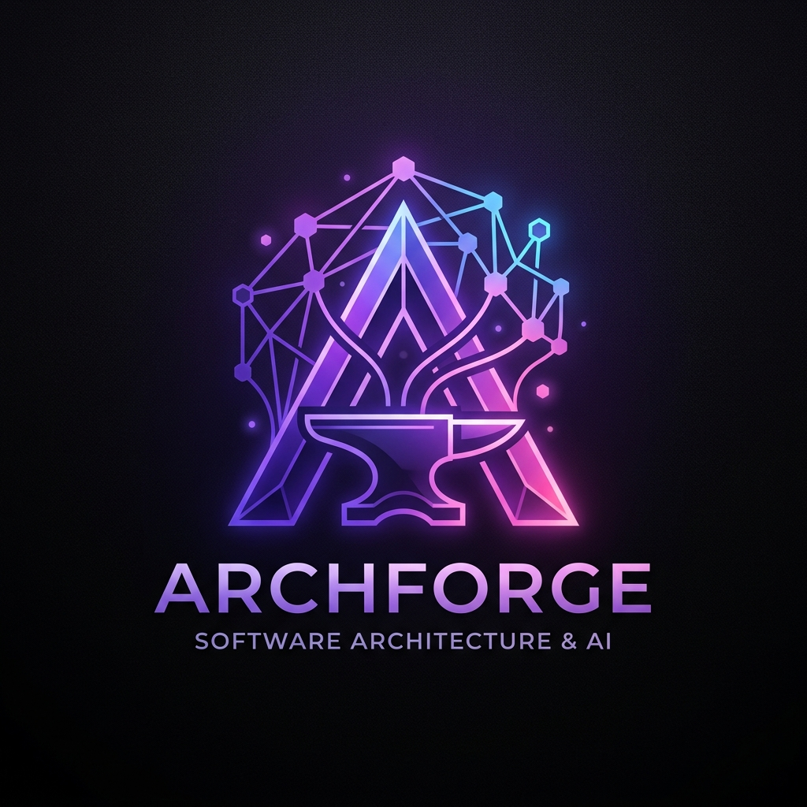

# 🌌 ArchForge

<p align="center">
  
</p>

**ArchForge** is a premium, AI-native software architecture intelligence platform. It autonomously indexes your codebase, maps dependencies, parses Infrastructure-as-Code (IaC), and leverages the power of Gemini AI to give you an interactive, high-level understanding of any project.

Whether you're onboarding new engineers, reviewing massive PRs, or migrating legacy code, ArchForge turns thousands of files into beautiful architecture graphs and intelligent conversations.

---

## ✨ Key Features

- 🧠 **AI Architecture Chat**: Ask questions about your architecture, and ArchForge will answer by combining semantic search and structural graph analysis of your codebase.
- 🏗️ **Infrastructure-as-Code (IaC) Parsing**: Automatically parses Dockerfiles, Kubernetes YAMLs, and Terraform `.tf` files to map out your cloud resources alongside your application code.
- 🎨 **Premium HLD Generation**: Instantly generate beautifully styled, Mermaid.js-powered High-Level Design (HLD) documents in your browser.
- 🤖 **Autonomous GitHub PR Agent**: ArchForge automatically intercepts GitHub Webhooks on Pull Requests, analyzes the architectural impact of the diff, and posts an AI review directly to your PR.
- 🔌 **VS Code Extension**: Highlight code directly in your IDE and ask ArchForge about its architectural implications via the built-in sidebar chat.
- ☁️ **Oracle Cloud CI/CD**: A fully configured GitHub Actions workflow (`deploy.yml`) allows for zero-downtime, continuous deployment to Oracle Cloud VMs via Docker Compose.

---

## 🛠️ Tech Stack

- **Backend**: Go (Tree-sitter for parsing ASTs, SQLite/PostgreSQL for storage)
- **Frontend**: Angular 17+ (Modern, dark-aurora themed UI)
- **AI Engine**: Google Gemini 3.6 Flash
- **Deployment**: Docker, Docker Compose, GitHub Actions (CI/CD)

---

## 🚀 Run Locally

### 1. Start the Backend
The Go backend handles AI orchestration, Git cloning, Tree-sitter parsing, and vector embeddings.

```bash
cd backend
# Make sure your .env has your GEMINI_API_KEY and GITHUB_CLIENT_ID
go run ./cmd/server
```
*API runs on `http://localhost:8080`*

### 2. Start the Frontend
The Angular frontend serves the premium Dashboard and HLD renderer.

```bash
cd frontend
npm install
npm start
```
*UI runs on `http://localhost:4200`*

### 3. VS Code Extension
To run the local IDE plugin:
```bash
cd archforge-vscode
npm install
npm run compile
```
*(Press **F5** in VS Code to launch the Extension Development Host)*

---

## ☁️ CI/CD & Deployment

ArchForge is fully containerized and configured for automated deployments to Oracle Cloud VMs (or any server) using **GitHub Actions**.

### How it works
1. **Push to `main`**: Any code pushed to the `main` branch triggers the `.github/workflows/deploy.yml` pipeline.
2. **Automated SSH**: GitHub Actions securely SSHs into your remote VM.
3. **Docker Compose**: The runner automatically pulls the latest code, rebuilds the `backend` and `frontend` Docker images, and restarts the services with zero downtime.

### Setup Instructions
To enable the deployment, add the following Repository Secrets to GitHub (`Settings > Secrets and variables > Actions`):
- `SSH_HOST`: Your VM's public IP address.
- `SSH_USERNAME`: Your VM username (e.g., `ubuntu` or `opc`).
- `SSH_PRIVATE_KEY`: Your private SSH key.

---

## 🗺️ Project Status

- [x] Authentication and user sessions (GitHub OAuth)
- [x] Repository import & deep parsing (Go, TS, Java, Rust, Docker, YAML, TF)
- [x] Semantic vector embeddings & Context-Aware RAG
- [x] Premium HLD rendering (Mermaid.js in browser)
- [x] GitHub PR Agent Webhook integration
- [x] VS Code Sidebar Extension
- [x] CI/CD Oracle Cloud Deployment

<p align="center"><i>Built with passion out of the box.</i></p>
